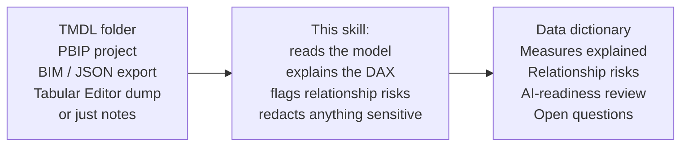
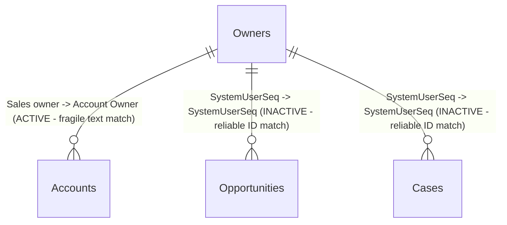

# document-powerbi-semantic-model

[](./LICENSE)

An agent skill that turns a Power BI semantic model into Markdown documentation: a data
dictionary, plain-language explanations of what the DAX actually does, a relationship review,
and an AI-readiness assessment if you want one.

It works from TMDL folders, PBIP projects, BIM/JSON metadata exports, Tabular Editor script
output, XMLA metadata exports, a plain measure list, or just notes you type in yourself. No
live model connection needed.

This is the counterpart to Microsoft's own `semantic-model-authoring` skill (part of their
`skills-for-fabric` collection). That one builds and edits models. This one reads an existing
model and explains it, so someone other than the person who built it can actually understand
it. It won't touch the model, deploy anything, or manage permissions.

## How it works



What you feed it, what it does, what you get back. The rest of this README is detail on each
of those three boxes.

## Why this exists

Every Power BI team eventually inherits a report like this: a small tweak comes in, or a
business user says a visual is showing the wrong numbers, or a report just feels slow. The
person who built it left the company months ago. There's no documentation. You open the model
and the DAX is written in someone else's style, everyone has their own conventions, so even
pasting a measure into an LLM only gets you so far. It can explain the syntax. It can't explain
what the measure actually means without knowing the model and business context sitting around
it.

That's the specific gap this closes: point it at the model, and it builds that missing context,
what each table and measure is actually for, how the relationships really work, where the real
risk is, in plain language.

It's not limited to inherited reports. If you build a model from scratch, you can run this the
same way to hand someone else clean documentation. But the reason it exists is the undocumented
one nobody else can explain.

The other half of the problem: most Power BI documentation tooling assumes a live Desktop
connection or an open XMLA endpoint. A lot of real documentation work doesn't start that way,
someone hands you a TMDL export, a PBIP project you didn't build, or a metadata dump from
Tabular Editor and nothing else. This skill works from whatever you actually have, no live
connection needed.

I built this after spending time reading through Microsoft's own `skills-for-fabric` collection
and noticing the gap: plenty of tooling for building and editing models, not much for making an
existing one legible to someone who didn't build it.

## What a .pbip project actually is

Most Power BI developers have never opened one of these — just the single `.pbix` file Desktop
saves by default. A Power BI Project (`.pbip`) splits that one file into two folders: a
`<name>.Report/` folder holding the report definition (pages, visuals, bookmarks, as PBIR/JSON)
and a `<name>.SemanticModel/` folder holding the model itself (tables, relationships, measures,
as TMDL text files when you use that format). The split exists so both halves are plain text
and diffable in source control instead of one opaque binary blob.

That split is also exactly why this skill can work from just the `.SemanticModel/` half. Every
table, column, measure, relationship, RLS role, and calculation group it documents lives in
that one folder — it never has to open or touch `.Report/` at all.

## Install

Copy this repo into the skill folder your agent already watches. No dependencies, no build
step.

**Claude Code:**
```bash
git clone https://github.com/saidev-pbi-fabric/document-powerbi-semantic-model ~/.claude/skills/document-powerbi-semantic-model
```

**Before you run the Codex CLI / GitHub Copilot CLI command below:** built and tested against
Claude Code — every example in this repo was generated by actually running the skill there, end
to end. It's positioned to work the same way for Codex CLI and GitHub Copilot CLI, since all
three read the same personal skills-folder convention and the same `SKILL.md` format. I haven't
verified it there as deeply: I've used Codex CLI far less than Claude Code, and Copilot CLI
wasn't runnable in my test environment. If you try it on either, open a GitHub issue with what
worked and what didn't — that's genuinely useful information at this stage, not just a
formality.

**Codex CLI or GitHub Copilot CLI** (both read from the same personal skills folder):
```bash
git clone https://github.com/saidev-pbi-fabric/document-powerbi-semantic-model ~/.agents/skills/document-powerbi-semantic-model
```

Restart your agent session afterward so it picks up the new skill.

## Example prompts

- "Document this Power BI semantic model."
- "Create a data dictionary from this TMDL folder."
- "Document this CRM sales model and flag anything risky in the relationships."
- "Explain the measures in this PBIP semantic model, plain language before the DAX."
- "Review this semantic model for AI/Copilot readiness."
- "Create onboarding docs for a new analyst using this model."
- "This model has calculation groups and RLS roles, document those too."

## What it produces

| File | When |
|---|---|
| `index.md` | Always, as the entry point |
| `model-overview.md` | Always: purpose, storage mode, scale, business domains |
| `data-dictionary.md` | Always: every table and column |
| `measures.md` | If measures exist: plain-language explanation plus DAX, grouped by business area |
| `relationships.md` | If more than one table exists: model shape, cardinality, anything risky flagged |
| `ai-readiness-review.md` | Only if you ask for it |
| `open-questions.md` | Whenever something's genuinely unclear, instead of pretending it isn't |

## Privacy by design

This is meant to be safe for producing documentation that ends up somewhere public. Before it
writes anything, it checks for tenant/workspace IDs, connection strings, file paths with
usernames baked in, internal group names, and sample production data, and generalizes them.
See [`references/privacy-and-redaction.md`](./references/privacy-and-redaction.md).

## See it working

`examples/` has two real, fully public Power BI sample models from Microsoft's own
[`powerbi-desktop-samples`](https://github.com/microsoft/powerbi-desktop-samples) repo, a
COVID-19 analytics model and a CRM sales/service model, along with the full documentation this
skill generated for each. Start at `examples/Smpl1-docs/index.md` or
`examples/Smpl2-docs/index.md`. Both catch real issues in the source models: a relationship
that relies on a fragile name match when a more reliable ID-based one existed but was left
inactive, a filter that's commented out inside otherwise-live DAX, a column whose whole formula
is `BLANK()`, a table with no relationship to anything else in the model. Nothing invented,
just what was actually in the TMDL.

Here's the actual relationship diagram from `examples/Smpl2-docs/relationships.md`, not a
mockup, generated from the real TMDL:



Same table, three ways to join it. The one actually driving the model today is the risky one.
The two safer ones exist and do nothing. That's the kind of thing this skill is built to catch,
shown plainly instead of buried in 40 tables of TMDL. Full diagram (14 relationships, the whole
model) is in the example file linked above.

## Structure

```
SKILL.md                  — the router: workflow, rules, what to load when
references/                — one file per topic, loaded as needed
assets/templates/          — the exact shape of each output file
examples/                  — two real public sample models plus their generated docs
```

## Scope

**In scope:** inspecting a model from files or exports; documenting tables, columns, measures,
relationships, hierarchies, calculation groups, perspectives, partitions, and data sources;
explaining DAX in plain language; a data dictionary and AI-readiness notes; Markdown output;
redacting anything sensitive along the way.

**Out of scope:** editing or deploying the model, publishing to Fabric, managing workspace
permissions, report visuals or PBIR files, running production queries you didn't explicitly
provide, RLS/OLS role membership.

## License

MIT, see [LICENSE](./LICENSE).
