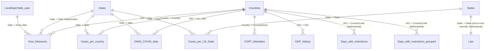

# Relationships and Modeling Review — COVID Bakeoff

## Model shape

Not a clean single-fact-table star schema — closer to a **multi-fact constellation** sharing
two common dimensions (`Countries` and `Dates`, plus `States` for the US-specific facts). Five
fact-like tables (`OWID COVID data`, `Cases per country`, `Cases per US State`, `CGRT
Mandates`, `Govt Measures`) each connect independently into `Countries` and/or `Dates` — there
is no single central fact table everything else hangs off of.

## Relationships

| From | To | Cardinality | Cross-filter | Active? |
|---|---|---|---|---|
| `Govt Measures[Entry date]` | `LocalDateTable (auto)[Date]` | Many-to-one (default) | Single | Yes |
| `Govt Measures[ISO]` | `Countries[ISO]` | Many-to-one (default) | Single | Yes |
| `Cases per country[Country]` | `Countries[Country]` | Many-to-one (default) | Single | Yes |
| `Cases per US State[State]` | `States[State]` | Many-to-one (default) | Single | Yes |
| `Cases per US State[Date]` | `Dates[Date]` | Many-to-one (default) | Single | Yes |
| `Cases per country[Date]` | `Dates[Date]` | Many-to-one (default) | Single | Yes |
| `Govt Measures[Date implemented]` | `Dates[Date]` | Many-to-one (default) | Single | Yes |
| `OWID COVID data[date]` | `Dates[Date]` | Many-to-one (default) | Single | Yes |
| `OWID COVID data[iso_code]` | `Countries[ISO]` | Many-to-one (default) | Single | Yes |
| `CGRT Mandates[CountryName]` | `Countries[Country]` | Many-to-one (default) | Single | Yes |
| `Days with restrictions[CountryCode]` | `Countries[ISO]` | Many-to-one (default) | **Both** | Yes |
| `GDP History[ISO]` | `Countries[ISO]` | Many-to-one (default) | Single | Yes |
| `Days with restrictions grouped[CountryCode]` | `Countries[ISO]` | Many-to-one (default) | **Both** | Yes |
| `Lats[State]` | `States[State]` | **One-to-one (explicit override)** | **Both** | Yes |

*(TMDL defaults to many-to-one when `fromCardinality`/`toCardinality` is absent — every
relationship above relies on that default except `Lats`→`States`, the one relationship with an
explicit `fromCardinality: one` override, confirming `Lats` holds exactly one row per state.
Declared cardinality reflects the TMDL definition, not independently re-verified against live
row counts this pass.)*

## Diagram

*(Entity names use underscores in place of spaces from the original table names — see the
Relationships table above for the exact TMDL names. `LocalDateTable_auto` is the
Power-BI-auto-generated date table `Govt Measures[Entry date]` connects to instead of the
model's own `Dates` table, as described under Date table below. All 14 relationships from the
table above are represented; none are added or omitted.)*

## Date table

`Dates` is the model's primary date table (manually built via `CALENDARAUTO()`), and is the
target of 4 of the relationships above. However, `Govt Measures[Entry date]` connects instead
to a Power-BI-auto-generated `LocalDateTable` — meaning this one column sits outside the
model's own intentional date dimension. This is very likely why the auto date table exists at
all (Power BI auto-creates one whenever a datetime column has no explicit relationship to a
marked date table). See `open-questions.md` for whether this was deliberate.

## Findings

### Worth knowing

- Five independent fact-like tables converge on `Countries`/`Dates` rather than one shared
  fact table — normal for a model built by combining multiple public datasets, but means
  cross-fact analysis (e.g. comparing OWID case rates against Govt Measures policy data)
  relies entirely on the shared dimensions filtering correctly, not a direct relationship
  between the two fact tables.
- `Countries` carries 2 measures referencing a different table (`GDP History`) — unusual but
  not wrong; see `measures.md`.

### Worth a second look

- **Three bidirectional relationships**, all involving `Countries` or `States` as the "one"
  side: `Days with restrictions`→`Countries`, `Days with restrictions grouped`→`Countries`,
  and `Lats`→`States`. Bidirectional filtering here means a selection on `Countries`/`States`
  filters back into these tables *and* a selection within these tables would filter
  `Countries`/`States` (and everything else connected to them) — worth confirming this is
  intentional for cross-filtering from a visual built on these tables, since it's a common
  source of unexpected filter propagation as a model grows.
- **`Lats` is hidden but drives a visible `Average Temperature`-derived column on `States`
  (`March Temperatures`).** Not a risk exactly, but worth knowing the temperature grouping
  visible to users depends on a hidden lookup table.
- **No naming-consistency issues found beyond minor casing** (e.g. `iso_code` vs. `ISO` for
  the same concept across different tables) — expected when combining multiple public
  datasets that don't share a naming convention, not a defect in this model's own authoring.
