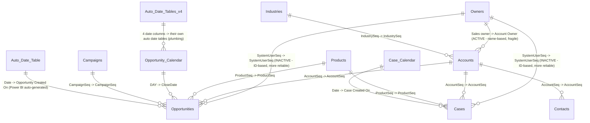

# Relationships and Modeling Review — Contoso CRM Sales & Service

## Model shape

A reasonably clean star schema centered on two fact tables (`Opportunities`, `Cases`) sharing
dimensions (`Accounts`, `Products`, `Owners`) — closer to a two-fact constellation than a
single star, since `Opportunities` and `Cases` don't relate to each other directly (they only
share dimensions). `Contacts`, `Industries`, and `Campaigns` are single-purpose dimensions off
`Accounts`/`Opportunities`. `Territories` sits completely outside the schema (see Findings).

## Relationships

| From | To | Cardinality | Cross-filter | Active? |
|---|---|---|---|---|
| `Accounts[Account Owner]` | `Owners[Sales owner]` | Many-to-one (default) | Single | Yes |
| `Opportunities[AccountSeq]` | `Accounts[AccountSeq]` | Many-to-one (default) | Single | Yes |
| `Cases[AccountSeq]` | `Accounts[AccountSeq]` | Many-to-one (default) | Single | Yes |
| `Contacts[AccountSeq]` | `Accounts[AccountSeq]` | Many-to-one (default) | Single | Yes |
| `Accounts[IndustrySeq]` | `Industries[IndustrySeq]` | Many-to-one (default) | Single | Yes |
| `Opportunities[ProductSeq]` | `Products[ProductSeq]` | Many-to-one (default) | Single | Yes |
| `Cases[ProductSeq]` | `Products[ProductSeq]` | Many-to-one (default) | Single | Yes |
| `Opportunities[SystemUserSeq]` | `Owners[SystemUserSeq]` | Many-to-one (default) | Single | **No** |
| `Cases[SystemUserSeq]` | `Owners[SystemUserSeq]` | Many-to-one (default) | Single | **No** |
| `Opportunities[CloseDate]` | `Opportunity Calendar[DAY]` | Many-to-one (default) | Single | Yes |
| `Opportunities[CampaignSeq]` | `Campaigns[CampaignSeq]` | Many-to-one (default) | Single | Yes |
| `Cases[Case Created On]` | `Case Calendar[Date]` | Many-to-one (default) | Single | Yes |
| `Opportunities[Opportunity Created On]` | auto date table `[Date]` | Many-to-one (default) | Single | Yes |
| `Opportunity Calendar`'s own 4 date-shaped columns | their respective auto date tables | Many-to-one (default) | Single | Yes (plumbing, not business relationships) |

*(No relationship in this model overrides TMDL's many-to-one default — unlike Smpl1, which had
one explicit override. Declared cardinality reflects the TMDL definition, not independently
re-verified against live row counts this pass.)*

## Diagram

*(All 14 relationships from the table above are represented; none are added or omitted.
`Territories` is deliberately not shown — the Relationships table above has no row connecting
it to anything, so drawing an edge for it would invent a relationship that isn't documented;
see Findings below. `Auto_Date_Table` and `Auto_Date_Tables_x4` are Power BI-auto-generated
date tables that aren't individually named in the source review, shown generically to match
what's actually documented. The two owner-lookup edges above are the model's single biggest
finding: the **active** path from `Accounts` to `Owners` is a text/name match, while the
**inactive**, more reliable ID-based paths from `Opportunities` and `Cases` sit unused — see
Findings for why that matters.)*

## Date tables

Two purpose-built calendar tables exist: `Case Calendar` (scoped to `Cases[Case Created On]`'s
date range) and `Opportunity Calendar` (scoped to `Opportunities[CloseDate]`'s range).
`Opportunities[Opportunity Created On]`, however, relates to neither — it connects to a
Power-BI-auto-generated date table instead, meaning opportunity creation-date analysis doesn't
share a date table with opportunity close-date analysis. Worth confirming this is intentional
if the two need to be compared on a common calendar.

## Findings

### Worth knowing

- Two fact tables (`Opportunities`, `Cases`) don't relate directly — any cross-analysis (e.g.
  "cases raised per opportunity") depends entirely on shared dimensions (`Accounts`,
  `Products`), not a direct link.
- `Opportunity Forecast Adjustment` is a deliberate what-if parameter table, not a modeling
  gap — its lack of a "real" relationship is expected for this pattern.

### Worth a second look

- **The owner relationship is name-based in its active form, and the ID-based equivalent is
  inactive.** `Accounts[Account Owner]` → `Owners[Sales owner]` (both text/string) is the
  *active* relationship driving owner-based filtering from `Accounts`. Meanwhile
  `Opportunities[SystemUserSeq]` → `Owners[SystemUserSeq]` and `Cases[SystemUserSeq]` →
  `Owners[SystemUserSeq]` — the more robust, ID-based joins — are both **inactive**. Text-name
  joins carry real risk (duplicate names, casing/whitespace mismatches, renamed owners) that
  ID-based joins avoid. Worth confirming this is a deliberate choice (e.g. `Opportunities`/
  `Cases` are meant to filter by owner only via `Accounts`, not directly) rather than an
  oversight where the "right" relationship was built but never activated.
- **`Territories` is completely unrelated to every other table in the model.** It contains
  Region/Territory/Country/State-abbreviation data that conceptually overlaps with
  `Accounts[Territory]`/`Accounts[Region]`, but no relationship connects them. Either an
  unused leftover table, or intended for a slicer-only/manual-lookup use not visible from the
  model structure alone — flagged, not resolved, in `open-questions.md`.
- **No bidirectional relationships found** in this model — a cleaner state than the COVID
  Bakeoff sample; nothing to flag on that front.
- **Naming inconsistency**: `AccountOwnerSeq` exists as a column on `Accounts` but isn't used
  in any relationship (the text-based `Account Owner` is used instead) — a second unused
  candidate key, similar in spirit to the `Territories` situation.
